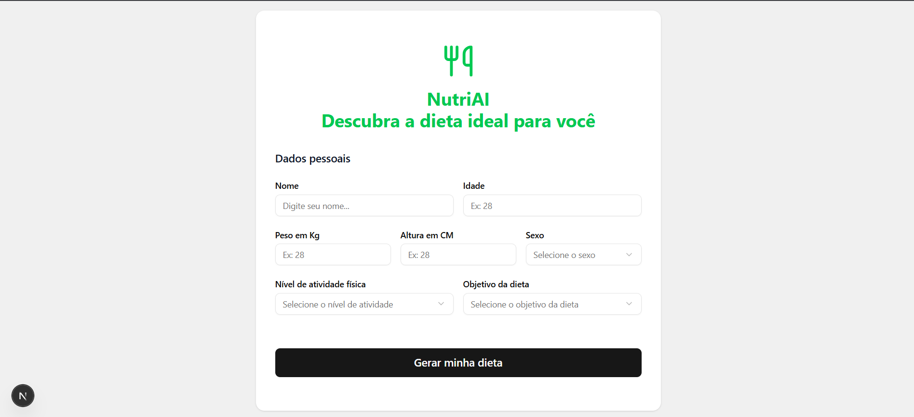

# 🤖🍏 NutriAI


> Uma aplicação inteligente que cria planos alimentares personalizados em tempo real, utilizando o poder da IA generativa do Google - Gemini 2.5-Flash.

## 📸 Screenshots

| Página Principal | Resultado da Dieta |
| :---: | :---: |
|  |  |

---

## ✨ Funcionalidades Principais

* **Funcionalidade 1:** Coleta de dados do usuário como idade, peso, altura e objetivos.
* **Funcionalidade 2:** Integração com API de IA para processar os dados e gerar um plano alimentar.
* **Funcionalidade 3:** Exibição da dieta personalizada em uma interface clara e amigável, com geração streaming (em tempo real, efeito de digitação).

---

## 🛠️ Tecnologias Utilizadas

Este projeto foi construído utilizando as seguintes tecnologias:

| Categoria | Tecnologia |
|-----------|------------|
| **Front-end** | `React` `Next.js` `CSS Modules` `TypeScript` |
| **Back-end**  | `Node.js` `Fastify` `Zod` `TypeScript` |
| **IA**        | `Google Generative AI API (Gemini 2.5-Flash)` |

---

## ⚙️ Como Executar o Projeto Localmente

Este projeto é dividido em duas partes: a **API** (back-end) e a **Web** (front-end). Ambas precisam ser executadas simultaneamente em terminais diferentes para que a aplicação funcione por completo.

### Pré-requisitos

Antes de começar, você precisará ter instalado em sua máquina:
* [Git](https://git-scm.com)
* [Node.js](https://nodejs.org/en/)
* [Gerenciador de pacotes como npm ou yarn](https://classic.yarnpkg.com/)

### 1. Clonando e Acessando o Projeto

```bash
# Clone este repositório
git clone [https://github.com/guilhermecunhadev-cloud/NutriAI.git](https://github.com/guilhermecunhadev-cloud/NutriAI.git)

# Acesse a pasta do projeto
cd NutriAI
```

# 2. Executando o Back-end (API) 🚀

```bash
# Navegue até a pasta da API
cd api


# Instale as dependências
npm install


# Crie e configure o arquivo de variáveis de ambiente
# (Este comando copia o conteúdo do .env.example para um novo arquivo .env)
cp .env.example .env


# Agora, abra o arquivo .env que foi criado na pasta api e adicione sua chave 
# secreta da API do Gemini:
# api/.env
GEMINI_API_KEY="sua-chave-secreta-aqui"
```

```bash
# Rode o servidor da API
npm run dev

# ✅ O servidor back-end estará em execução. Geralmente em http://localhost:5000. Deixe este terminal rodando.
```

# 3. Executando o front-end

```bash
# Abra um NOVO terminal na raiz do projeto para executar os comandos abaixo.

# Navegue até a pasta da aplicação web
cd web


# Instale as dependências
npm install
```

```bash
# Rode a aplicação web
npm run dev

#✅ A aplicação web estará acessível no seu navegador. 
# Geralmente em http://localhost:3000
```

---

## 🧠 Desafios e Aprendizados

Durante o desenvolvimento deste projeto, enfrentei alguns desafios interessantes, como garantir que a IA siga as diretrizes e prompts definidos, sem as "alucinações" ou informações incorretas. Além disso, a configuração para streaming da resposta pela IA foi um desafio novo, por ser a primeira experiência com streaming. A solução encontrada foi construir um arquivo markdown com regras para a IA, além de um prompt único do sistema demonstrando como ela deveria formular as dietas. Isso me proporcionou um grande aprendizado em manipulação de APIs de LLMs, transmissão de dados da API para o front-end e criação de prompts específicos para agentes de IA personalizados.

---

## 🚀 Próximos Passos (Roadmap)

Embora o projeto esteja funcional, planejo implementar as seguintes melhorias no futuro:

- [ ] Implementar sistema de autenticação de usuários (Login/Cadastro).
- [ ] Criar um banco de dados para salvar o histórico de dietas de cada usuário.
- [ ] Adicionar funcionalidade para acompanhar o progresso e ajustar a dieta.

---

## 📬 Contato

Gostou do projeto? Entre em contato!

* **LinkedIn:** [https://www.linkedin.com/in/guilherme-cunha/](https://www.linkedin.com/in/guilherme-cunha/)
* **Email:** [guilhermecunha.dev@gmail.com](mailto:guilhermecunha.dev@gmail.com)

Obrigado pelo apoio e por ter lido até aqui! 👨‍💻👊